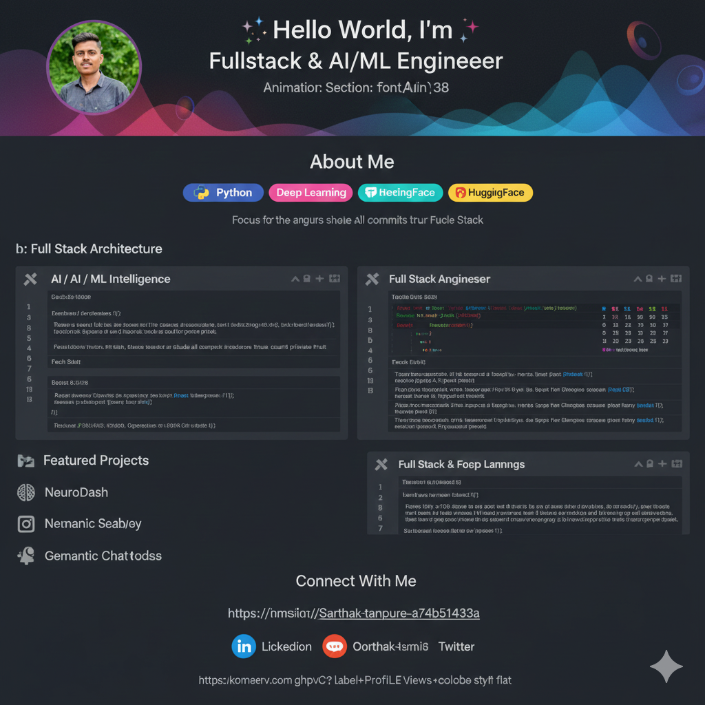

  

# 
✨ Hello World, I'm Sarthak ✨

  

  
  
  

---

## 🚀 About Me

I am a digital architect specializing in building **intelligent ecosystems**. I combine the precision of **Full Stack Development** with the predictive power of **Machine Learning** to create applications that don't just function—they think.

- 🧠 **Neural Networks:** Designing custom architectures for CV and NLP tasks.
- 🌐 **Scalable Web:** Building high-performance interfaces with React/Next.js and robust backends.
- ⚡ **Performance:** Optimizing model inference and database queries for real-time speed.
- 🎨 **Philosophy:** Beautiful UI outside, elegant algorithms inside.

---

## 🛠️ My Tech Universe

### 🧠 AI / ML Intelligence

### 🌐 Full Stack Mastery

---

## 📊 GitHub Analytics

  
  

---

## 🎨 Featured Projects

| Project              | Description                                                     | Tech Stack                    |
| :------------------- | :-------------------------------------------------------------- | :---------------------------- |
| **🧠 NeuroDash**     | Real-time AI analytics dashboard with live inference streaming. | React, FastAPI, PyTorch       |
| **☁️ CloudVision**   | Serverless object detection API deployed globally.              | AWS Lambda, OpenCV, Terraform |
| **💬 Semantic Chat** | A RAG-based chatbot using custom vector embeddings.             | LangChain, Pinecone, Next.js  |

---

## 📫 Connect With Me

  

